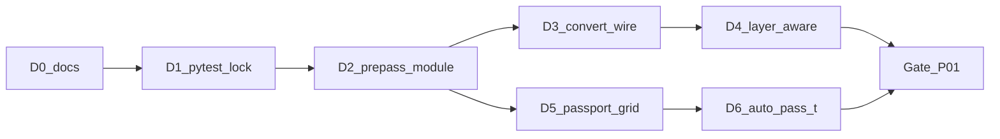

# Basket P01 — слой и паспорт в живом контуре (D0–D6)

**Статус:** исторический план/чекпоинт 2026-08-22; код D0–D6 целиком в текущий `main` не вошёл
**Дата:** 2026-08-22  
**Резюме для человека:** [РЕЗЮМЕ_P01.md](./РЕЗЮМЕ_P01.md)  
**Опора:** [ТЗ_ОБРАБОТКА_ИНФОРМАЦИИ.md](../../ТЗ_ОБРАБОТКА_ИНФОРМАЦИИ.md) §3.3, §5.2–5.3 · локальные `hf_runs/.../SVERKA_S_IDEAL.md` и `УСЛОВНЫЕ_ОБОЗНАЧЕНИЯ_В_ИДЕАЛ.md` (не гарантируются в git)

> **Важно для новых работ:** этот basket фиксирует локальную реализацию 2026-08-22, сохранённую отдельно от `main`. Не применять фазы D1–D6 буквально и не восстанавливать старый код поверх актуального `main`. Удалённая ветка реализовала часть целей другой архитектурой: `deglyph.py`, `pdf_tables.py`, `service/convert.py`, schema 5 и отдельные пороги layer-aware.

Методология витка — как в `kultura1905/docs/AGENT_HARNESS_GUIDE.md`: Ask → решение человека → Agent по `@PHASE_Dn` → verify → checkpoint. Чат — память одного витка; решения — здесь и в `PHASE_Dn_*.md`.

---

## Зачем документ

Ревью кода 2026-08-22 показало, что `deglyph.py` и `pdf_tables.py` не были включены в живой путь. В актуальном `main` эта часть уже исправлена: HTTP-контур отдаёт слой после deglyph и таблицы из PDF. Открытыми остаются pytest-регрессии, распознавание растровой таблицы, автоматический PASS-T и выравнивание CLI/HTTP.

**Правило:** один Dn = один виток. Не запускать «сделай P0 и P1». Не стартовать Dn+1 без checkpoint предыдущего.

**Исключение:** D0 (только docs) — без отдельного Ask-витка.

---

## North star

Живой контур (HTTP + тот же `run_vlm`) выполняет ТЗ §5.2–5.3: слой чинится по документу, таблицы собираются геометрией, паспорт не объявляет ведомость схемой только потому что слой пуст, лист-таблица не режется на тайлы.

**Готово, когда** одновременно:

1. На комплекте с битым, но чинимым ToUnicode (ориентир — ИОС2) сервис отдаёт непустой `extractedText` и блок «Таблицы листа (из PDF)», а `layer-aware` не гоняет PASS-B.
2. На «немом» листе-таблице вроде КР5 из `01.pdf` паспорт даёт `table`, путь — PASS-T или геометрия, не `scheme` + четверти плана.
3. Контракт `## Страница N` / `### PASS-0/A/B` и шапка `**Файл:**` не сломаны.
4. Обязательный verify зелёный **без** `HF_TOKEN` (кроме явного opt-in в scope-doc).

---

## Вне scope всего Basket P01

- Промпты легенды, словарь знаков, привязка экземпляров (P2.1)
- Карман фактов в клиентский markdown из PASS-B (P2.2)
- `deromanize` / конфликты ИГЭ↔ПГ (P3.1)
- Выравнивание дефолтов CLI ↔ HTTP, кроме проводки pre-pass (P3.2)
- `zone-hints`, `crop_content_zones`, `HARD_PAGES`
- Quality-gate PASS-A (длина / «подземные» / номенклатура)
- LLM-synth, полностраничный OCR, ГОСТ-классификатор значков
- Сверка комплекта с ТЗ стройки

После gate D6 — отдельный basket: P3.2 → P2.2 → P3.1 → P2.1.

---

## Исторические решения R1–R4 (не переносить в main без нового replan)

| ID | Решение |
|---|---|
| **R1** | Предлагался новый модуль `doc_context.py`. В актуальном main его нет; задачи разделены между `deglyph.py`, `pdf_tables.py` и `service/convert.py`. |
| **R2** | Словарь глифов, рамка штампа и шифр — по **всему PDF**, не только по `pagesRequested`. Один проход MuPDF, без VLM. |
| **R3** | Слой пригоден → таблицы только `pdf_tables`. Слоя нет и `kind==table` → PASS-T. Модель ведомость не перепечатывает, если слой живой. |
| **R4** | Предлагался кэш `hf_runs/<run>/doc_context.json`. В актуальном main используется процессный кэш `deglyph`, без такого JSON. |

R1–R4 описывают исторический вариант. Любая новая реализация должна начинаться с replan относительно актуальных функций, а не с восстановления `doc_context.py`.

---

## Pipeline на каждый Dn

```text
1. Открыть active scope (PHASE_Dn_*.md) — D2…D6 писать перед стартом витка
2. Ask: план / риски / A/B — без правок кода
3. Человек: утвердить scope (можно сузить)
4. Agent: только in scope + @PHASE_Dn
5. Verify: команды из scope-doc
6. Checkpoint: таблица в PHASE_Dn + строка статуса здесь
```

**Не делать:** один Agent-промпт «сделай D1–D6»; merge без verify; правки вне out of scope; вызов HF в обязательном verify.

Промпт на виток:

```text
Режим: Agent
Цель: только фаза Dn из @docs/active/PHASE_Dn_….md
In scope / Out of scope / Acceptance — из файла
Не коммитить без запроса. Не открывать P2/P3. Не звать HF.
Verify: команды из того же файла.
```

Шаблон scope: [PHASE_TEMPLATE.md](./PHASE_TEMPLATE.md).

---

## Очередь поставок

| Dn | Тема | P | Runtime | Verify без модели | Active scope | Статус |
|----|------|---|---------|-------------------|--------------|--------|
| **D0** | Operational harness + baseline | — | нет | чтение docs | этот файл + [PHASE_D0_harness.md](./PHASE_D0_harness.md) | **docs сохранены** |
| **D1** | Pytest-замок на текущее поведение | фундамент | тесты only | `pytest -q` | [PHASE_D1_pytest_lock.md](./PHASE_D1_pytest_lock.md) | **нет в main** |
| **D2** | Модуль `doc_context.py` (map + frames + шифры) | P0 | да | `pytest` + сухой прогон | [PHASE_D2_prepass.md](./PHASE_D2_prepass.md) | **замещён другой архитектурой** |
| **D3** | Вшить в `convert`: слой + таблицы | P0 | да | replay `hf_runs` + mock smoke | [PHASE_D3_convert_wire.md](./PHASE_D3_convert_wire.md) | **цель реализована иначе** |
| **D4** | `layer-aware` смотрит починенный слой | P0 | да | unit, мок vision | [PHASE_D4_layer_aware.md](./PHASE_D4_layer_aware.md) | **цель реализована иначе** |
| **D5** | Паспорт: сетка/линии, не `large→scheme` | P1 | да | `build_passport` на `01.pdf` стр. 5 | [PHASE_D5_passport_grid.md](./PHASE_D5_passport_grid.md) | **нет в main** |
| **D6** | Авто-PASS-T, если `kind==table` и слой непригоден | P1 | да | unit-роутинг; real — opt-in | [PHASE_D6_auto_pass_t.md](./PHASE_D6_auto_pass_t.md) | **нет в main; PASS-T ручной** |



После D2 ветки D3→D4 и D5→D6 можно параллелить **разным людям**, не одному Agent.

**Не параллелить в одном PR:**

| Пара | Общий файл |
|------|------------|
| D4 ‖ D6 | `hf_api_bench.py` → `run_vlm` |
| D3 ‖ D4 | `service/convert.py` |
| D5 ‖ D6 | `kind` должен устаканиться до роутинга |

---

## Фикстуры (не в git)

Тестовые PDF и прогоны в `.gitignore`. Verify на них — с диска разработчика; в pytest — skip, если файла нет.

| Имя | Путь | Зачем |
|-----|------|--------|
| ИОС2 | `new_files/Раздел ПД №5 Подраздел №2 (ИОС2).pdf` | чинимый/живой слой, deglyph, таблицы, `layer-aware` |
| Немой комплект | `new_files/01.pdf` (листы 1–5) | `text_len: 0`; паспорт; КР5 как table |
| Прогон сверки | `hf_runs/20260819_132438_qwen3vl-32b_sheetaware/` | replay `page_to_frontend` без VLM |
| Сверка | тот же прогон, `SVERKA_S_IDEAL.md` | сюжет ошибок (не KPI приёмки D0–D6) |

Крошечные PDF для D1 можно класть в `tests/fixtures/` (без эталонных комплектов).

---

## Baseline: исторический и текущий

На D0 в `PTO-work` не было pytest и каталога `docs/`. Сейчас `docs/active/` есть, но `tests/`, `pytest.ini` и зависимость pytest из локальной реализации D1 в `main` не вошли. Поэтому `python -m pytest -q` нельзя считать текущим обязательным gate.

Доступная проверка текущего HTTP-контура:

```powershell
cd PTO-work
python -c "import local_ocr; print(local_ocr.ocr_healthcheck())"
python -m service.smoke_test --pages 1
# только mock; real требует --yes-real и HF_TOKEN
```

Контракт, который D1 должен зафиксировать тестом:

- `convert.build_page_markdown` содержит `**Файл:**`
- `convert.page_layer_text`: garbled → `""`
- `deglyph`: короткое слово без двух свидетелей не маппится
- `build_passport` на пустом большом листе сейчас даёт `scheme` (якорь для D5)

Если регрессионный набор будет восстановлен, тесты нужно писать заново против schema 5, текущих API и порогов: для `plan/scheme/mixed/table` пригодность слоя требует 1500 символов и 200 слов, а не единого порога 400.

---

## Новый gate для актуального main

Пока не выполнено — не открывать P2/P3:

| Проверка | Как |
|----------|-----|
| Контракт заголовков | `extract_pass` на свежем mock-прогоне |
| Клиентский лист | `**Файл:**`, `kind`, пустой `extractedText` на немом CAD |
| Слой чинится в API | ИОС2 или фикстура: `extractedText` не пустой после deglyph |
| Таблица без слоя | отдельно проверить текущий ручной `--table-pages`; авто-PASS-T считать будущей доработкой |
| Нет подсказки тест-сета | D4–D6 не трогали `ZONE_HINTS` / `crop_content_zones` |
| Деньги | ни один обязательный verify не ходил в HF |

---

## Риски → replan, не «починить в том же PR»

1. `find_tables()` пуст на КР5 — D5 не рисует `table`. Ask + правка D5/D6, не промпт.
2. Runtime deglyph использует текущий порог покрытия 60%; пороги не крутить под один файл.
3. `PTO_PAGE_CONCURRENCY>1` уже поддерживается; документные кэши должны быть готовы до параллельного чтения.
4. Перед новой фазой восстановить минимальный pytest-набор либо явно использовать `service.smoke_test` и ручные фикстуры как временный gate.

---

## Docs обновлять после checkpoint

| Файл | Что |
|------|-----|
| Этот файл | статус Dn в таблице |
| `PHASE_Dn_*.md` | таблица Checkpoint |
| `README.md` / `service/README.md` | обновлять только если меняется действующий контракт |

---

## Checkpoint документа

| Поле | Значение |
|------|----------|
| Исторический runtime-код | Локально существовали `doc_context`, grid passport и авто-PASS-T; в текущем `main` их нет. |
| D0 | **сохранён как документация** |
| D1 | **нет в main** — тестовый набор требуется восстановить заново |
| D2 | **не переносить** — заменён текущими `deglyph` / `pdf_tables` |
| D3 | **цель закрыта upstream** — слой и таблицы отдаются через `service/convert.py`, schema 5 |
| D4 | **цель закрыта upstream** — действуют текущие drawing-specific пороги layer-aware |
| D5 | **открыто** — grid/raster table signal отсутствует |
| D6 | **открыто** — PASS-T включается вручную через `--table-pages` |
| Следующий виток | Новый P01b: тестовый lock → растровый/table routing → auto PASS-T, каждый шаг против актуального main. |
| Оговорка | `01.pdf` КР5 — растр, kind=`scheme`; `--table-pages 5` остаётся ручным обходом. |
