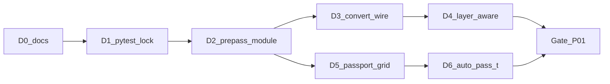

# Basket P01 — слой и паспорт в живом контуре (D0–D6)

**Статус:** D0–D6 done · gate P01 (с оговоркой КР5/растр)  
**Дата:** 2026-08-22  
**Резюме для человека:** [РЕЗЮМЕ_P01.md](./РЕЗЮМЕ_P01.md)  
**Опора:** [ТЗ_ОБРАБОТКА_ИНФОРМАЦИИ.md](../../ТЗ_ОБРАБОТКА_ИНФОРМАЦИИ.md) §3.3, §5.2–5.3 · [SVERKA_S_IDEAL.md](../../hf_runs/20260819_132438_qwen3vl-32b_sheetaware/SVERKA_S_IDEAL.md) · [УСЛОВНЫЕ_ОБОЗНАЧЕНИЯ_В_ИДЕАЛ.md](../../УСЛОВНЫЕ_ОБОЗНАЧЕНИЯ_В_ИДЕАЛ.md) (только как «не имитировать легенду»)

Методология витка — как в `kultura1905/docs/AGENT_HARNESS_GUIDE.md`: Ask → решение человека → Agent по `@PHASE_Dn` → verify → checkpoint. Чат — память одного витка; решения — здесь и в `PHASE_Dn_*.md`.

---

## Зачем документ

Ревью кода (2026-08-22) показало: `deglyph.py` и `pdf_tables.py` написаны по ТЗ, но живой путь (`run_vlm` / `service/convert.py`) их не вызывает. Паспорт на пустом слое объявляет большой лист `scheme`. Это P0/P1. Без harness легко слить это с промптами легенды (P2) или сменой CLI-дефолтов (P3).

**Правило:** один Dn = один виток. Не запускать «сделай P0 и P1». Не стартовать Dn+1 без checkpoint предыдущего.

**Исключение:** D0 (только docs) — без отдельного Ask-витка.

---

## North star

Живой контур (HTTP + тот же `run_vlm`) выполняет ТЗ §5.2–5.3: слой чинится по документу, таблицы собираются геометрией, паспорт не объявляет ведомость схемой только потому что слой пуст, лист-таблица не режется на тайлы.

**Готово, когда** одновременно:

1. На комплекте с битым, но чинимым ToUnicode (ориентир — ИОС2) сервис отдаёт непустой `extractedText` и блок «Таблицы листа (из PDF)», а `layer-aware` не гоняет PASS-B.
2. На «немом» листе-таблице вроде КР5 из `01.pdf` паспорт даёт `table`, путь — PASS-T или геометрия, не `scheme` + четверти плана.
3. Контракт `## Страница N` / `### PASS-0/A/B` и шапка `**Файл:**` не сломаны.
4. Обязательный verify зелёный **без** `HF_TOKEN` (кроме явного opt-in в scope-doc).

---

## Вне scope всего Basket P01

- Промпты легенды, словарь знаков, привязка экземпляров (P2.1)
- Карман фактов в клиентский markdown из PASS-B (P2.2)
- `deromanize` / конфликты ИГЭ↔ПГ (P3.1)
- Выравнивание дефолтов CLI ↔ HTTP, кроме проводки pre-pass (P3.2)
- `zone-hints`, `crop_content_zones`, `HARD_PAGES`
- Quality-gate PASS-A (длина / «подземные» / номенклатура)
- LLM-synth, полностраничный OCR, ГОСТ-классификатор значков
- Сверка комплекта с ТЗ стройки

После gate D6 — отдельный basket: P3.2 → P2.2 → P3.1 → P2.1.

---

## Решения R1–R4 (зафиксированы 2026-08-22)

| ID | Решение |
|---|---|
| **R1** | Новый модуль `doc_context.py`. Воркер только вызывает. Не складывать pre-pass в `worker.py`. |
| **R2** | Словарь глифов, рамка штампа и шифр — по **всему PDF**, не только по `pagesRequested`. Один проход MuPDF, без VLM. |
| **R3** | Слой пригоден → таблицы только `pdf_tables`. Слоя нет и `kind==table` → PASS-T. Модель ведомость не перепечатывает, если слой живой. |
| **R4** | Кэш: `hf_runs/<run>/doc_context.json`. После рестарта не пересчитывать, если файл есть и PDF тот же (mtime + size). |

Менять R1–R4 — только через replan в этом файле, не «заодно» в Agent.

---

## Pipeline на каждый Dn

```text
1. Открыть active scope (PHASE_Dn_*.md) — D2…D6 писать перед стартом витка
2. Ask: план / риски / A/B — без правок кода
3. Человек: утвердить scope (можно сузить)
4. Agent: только in scope + @PHASE_Dn
5. Verify: команды из scope-doc
6. Checkpoint: таблица в PHASE_Dn + строка статуса здесь
```

**Не делать:** один Agent-промпт «сделай D1–D6»; merge без verify; правки вне out of scope; вызов HF в обязательном verify.

Промпт на виток:

```text
Режим: Agent
Цель: только фаза Dn из @docs/active/PHASE_Dn_….md
In scope / Out of scope / Acceptance — из файла
Не коммитить без запроса. Не открывать P2/P3. Не звать HF.
Verify: команды из того же файла.
```

Шаблон scope: [PHASE_TEMPLATE.md](./PHASE_TEMPLATE.md).

---

## Очередь поставок

| Dn | Тема | P | Runtime | Verify без модели | Active scope | Статус |
|----|------|---|---------|-------------------|--------------|--------|
| **D0** | Operational harness + baseline | — | нет | чтение docs | этот файл + [PHASE_D0_harness.md](./PHASE_D0_harness.md) | **done** |
| **D1** | Pytest-замок на текущее поведение | фундамент | тесты only | `pytest -q` | [PHASE_D1_pytest_lock.md](./PHASE_D1_pytest_lock.md) | **done** |
| **D2** | Модуль `doc_context.py` (map + frames + шифры) | P0 | да, ещё не вшит в выдачу | `pytest` + сухой прогон | [PHASE_D2_prepass.md](./PHASE_D2_prepass.md) | **done** |
| **D3** | Вшить в `convert`: слой + таблицы | P0 | да | replay `hf_runs` + mock smoke | [PHASE_D3_convert_wire.md](./PHASE_D3_convert_wire.md) | **done** |
| **D4** | `layer-aware` смотрит починенный слой | P0 | да | unit, мок vision | [PHASE_D4_layer_aware.md](./PHASE_D4_layer_aware.md) | **done** |
| **D5** | Паспорт: сетка/линии, не `large→scheme` | P1 | да | `build_passport` на `01.pdf` стр. 5 | [PHASE_D5_passport_grid.md](./PHASE_D5_passport_grid.md) | **done** |
| **D6** | Авто-PASS-T, если `kind==table` и слой непригоден | P1 | да | unit-роутинг; real — opt-in | [PHASE_D6_auto_pass_t.md](./PHASE_D6_auto_pass_t.md) | **done** |



После D2 ветки D3→D4 и D5→D6 можно параллелить **разным людям**, не одному Agent.

**Не параллелить в одном PR:**

| Пара | Общий файл |
|------|------------|
| D4 ‖ D6 | `hf_api_bench.py` → `run_vlm` |
| D3 ‖ D4 | `service/convert.py` |
| D5 ‖ D6 | `kind` должен устаканиться до роутинга |

---

## Фикстуры (не в git)

Тестовые PDF и прогоны в `.gitignore`. Verify на них — с диска разработчика; в pytest — skip, если файла нет.

| Имя | Путь | Зачем |
|-----|------|--------|
| ИОС2 | `new_files/Раздел ПД №5 Подраздел №2 (ИОС2).pdf` | чинимый/живой слой, deglyph, таблицы, `layer-aware` |
| Немой комплект | `new_files/01.pdf` (листы 1–5) | `text_len: 0`; паспорт; КР5 как table |
| Прогон сверки | `hf_runs/20260819_132438_qwen3vl-32b_sheetaware/` | replay `page_to_frontend` без VLM |
| Сверка | тот же прогон, `SVERKA_S_IDEAL.md` | сюжет ошибок (не KPI приёмки D0–D6) |

Крошечные PDF для D1 можно класть в `tests/fixtures/` (без эталонных комплектов).

---

## Baseline (факт на D0)

В `PTO-work` **нет** pytest и нет `docs/` до этой поставки. Целевая команда после D1: `python -m pytest -q` из корня `PTO-work`.

Уже существующие проверки (не заменяют D1):

```powershell
cd PTO-work
python -c "import local_ocr; print(local_ocr.ocr_healthcheck())"
python -m service.smoke_test --pages 1
# только mock; real требует --yes-real и HF_TOKEN
```

Контракт, который D1 должен зафиксировать тестом:

- `convert.build_page_markdown` содержит `**Файл:**`
- `convert.page_layer_text`: garbled → `""`
- `deglyph`: короткое слово без двух свидетелей не маппится
- `build_passport` на пустом большом листе сейчас даёт `scheme` (якорь для D5)

---

## Gate после D6 (stop всего P01)

Пока не выполнено — не открывать P2/P3:

| Проверка | Как |
|----------|-----|
| Контракт заголовков | `extract_pass` на свежем mock-прогоне |
| Клиентский лист | `**Файл:**`, `kind`, пустой `extractedText` на немом CAD |
| Слой чинится в API | ИОС2 или фикстура: `extractedText` не пустой после deglyph |
| Таблица без слоя | паспорт `table` + роутинг PASS-T в unit |
| Нет подсказки тест-сета | D4–D6 не трогали `ZONE_HINTS` / `crop_content_zones` |
| Деньги | ни один обязательный verify не ходил в HF |

---

## Риски → replan, не «починить в том же PR»

1. `find_tables()` пуст на КР5 — D5 не рисует `table`. Ask + правка D5/D6, не промпт.
2. Deglyph не проходит гейт 90/85 на новом PDF — честный пустой map, пороги не крутить под файл.
3. `PTO_PAGE_CONCURRENCY>1` — pre-pass обязан закончиться до пула листов. Чинить в D2, не в D4.
4. Нет зелёного pytest после D1 — стоп, в D2 не идём.

---

## Docs обновлять после checkpoint

| Файл | Что |
|------|-----|
| Этот файл | статус Dn в таблице |
| `PHASE_Dn_*.md` | таблица Checkpoint |
| [CLAUDE.md](../../CLAUDE.md) | не трогать, пока не закроется gate (отдельное решение) |

---

## Checkpoint документа

| Поле | Значение |
|------|----------|
| Runtime-код менялся | D6: `should_run_pass_t` + авто PASS-T в `run_vlm` |
| D0 | **done** — 2026-08-22 |
| D1 | **done** — 2026-08-22. `tests/` + `pytest.ini`; `pytest>=8` в `requirements.txt`. |
| D2 | **done** — 2026-08-22. `doc_context.build` / кэш JSON. |
| D3 | **done** — 2026-08-22. Слой/таблицы/шифр в клиентский лист. |
| D4 | **done** — 2026-08-22. layer-aware по `page_layer` + кэш. |
| D5 | **done** — 2026-08-22. Векторная H/V решётка → `table`. |
| D6 | **done** — 2026-08-22. Авто PASS-T. Verify: 36 passed, 1 skipped. |
| Следующий виток | Gate P01 (человек). Затем отдельный basket: P3.2 → P2.2 → P3.1 → P2.1. `CLAUDE.md` не трогать, пока gate не принят. |
| Оговорка gate | `01.pdf` КР5 — растр, kind=`scheme`; авто PASS-T на нём нет. `--table-pages 5` жив. |
